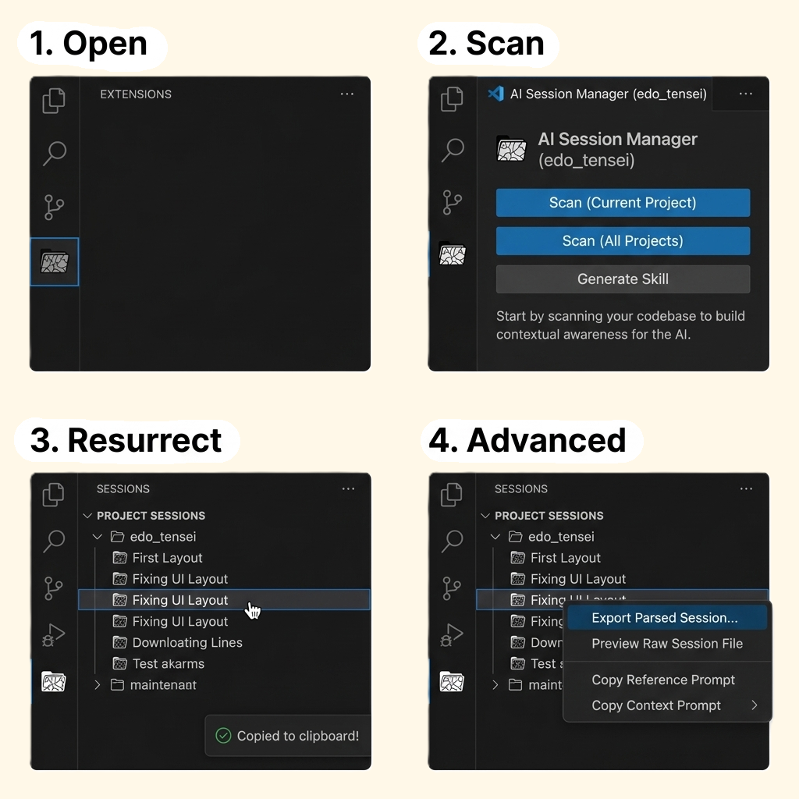

# Edo Tensei – AI 세션 인계 관리자

[](https://marketplace.visualstudio.com/items?itemName=Pain-Labs.edo-tensei)
[](https://marketplace.visualstudio.com/items?itemName=Pain-Labs.edo-tensei)
[](https://pain-labs.github.io/Edo-Tensei/llms.txt)

[繁體中文](README.zh-TW.md) | [English](../README.md) | [日本語](README.ja.md) | 한국어 | [简体中文](README.zh-CN.md)


---

## Edo Tensei란?

작업 도중 AI 할당량이 소진되더라도, 다른 IDE로 전환한다고 해서 모든 컨텍스트를 잃어야 할 이유는 없습니다.

**Edo Tensei**（穢土転生, "불순한 세계의 환생"）는 머신에 설치된 IDE에서 로컬 AI 세션 기록을 추출하여 바로 붙여넣기 할 수 있는 인계 프롬프트로 패키징합니다 — 다음 에이전트가 이전 에이전트가 멈춘 곳에서 정확히 이어받을 수 있도록.

### 이름의 유래와 로직

만화 『나루토』에서 **예토전생**（穢土転生, Edo Tensei）은 죽은 자의 영혼을 현세로 불러내어 그릇이 되는 생체에 묶어둠으로써 생전의 기억과 능력을 복원하는 금술입니다.

본 도구는 이 개념에서 이름을 따왔으며, AI 개발에서의 「컨텍스트의 윤회전생」을 상징합니다:

- **죽은 자 (The Deceased)**: 할당량 제한, IDE 충돌, 도구 전환 등으로 인해 「중단」된 이전 세션.
- **그릇/매개체 (The Vessel)**: 본 도구가 추출하고 패키징한 **인계 프롬프트 (Handoff Prompt)**.
- **환생 (The Reincarnation)**: 프롬프트를 새 IDE에 붙여넣음으로써, 본래 「죽었던」 개발 컨텍스트가 새로운 AI 개체에서 완벽하게 다시 태어나게 합니다.


---

> **플랫폼**: Windows 전용. macOS와 Linux는 아직 지원되지 않습니다.

## 지원 IDE

| IDE / 에이전트 | 로컬 저장 경로 | 비고 |
| :--- | :--- | :--- |
| GitHub Copilot Chat | `%APPDATA%/Code/User/…/chatSessions/` | JSON & JSONL |
| Cursor | `~/.cursor/projects/` | JSONL |
| Claude Code CLI | `~/.claude/projects/` | JSONL |
| OpenAI Codex CLI | `~/.codex/` | JSONL |
| Kiro | `%APPDATA%/Kiro/…/kiroagent/` | JSON (`.chat`) |
| Antigravity | `~/.gemini/antigravity/brain/` | 미리보기 로그만 — 알려진 제한 사항 참조 |

---

## 주요 기능

- **멀티 IDE 추출**: 지원되는 모든 IDE를 자동 스캔하여 `IDE → 프로젝트 → 세션` 형태로 표시합니다.
- **프로젝트 범위 스캔**: "프로젝트 세션 스캔"으로 현재 워크스페이스와 일치하는 세션만 필터링합니다.
- **두 가지 인계 모드**:
  - **경로 모드** *(기본값)*: 세션 파일 경로 + IDE별 읽기 가이드를 출력합니다. 토큰 효율적이며, 수신 에이전트는 필요한 부분만 읽습니다.
  - **전체 텍스트 모드**: 전체 대화를 포함합니다. 어디서나 작동하지만 더 많은 토큰을 사용합니다.
- **원클릭 소환**: 형식화된 인계 프롬프트를 클립보드에 복사 — 새 AI 채팅에 붙여넣기만 하면 컨텍스트가 즉시 복원됩니다.
- **`.edo_tensei/`로 내보내기**: 인계 프롬프트를 `IDE/프로젝트/타임스탬프` 형태로 정리된 Markdown 파일로 저장합니다.
- **원본 파일 미리보기**: VS Code에서 직접 원본 세션 파일을 열어 검사하거나 편집할 수 있습니다.
- **Agent Skill Generator**: Claude Code, GitHub Copilot, Kiro, Antigravity, Cline, Gemini CLI, Cursor용으로 재사용 가능한 `edo-tensei` skill/rule 파일을 생성합니다.
- **`.gitignore` 헬퍼**: 처음 사용 시 `.edo_tensei/`를 `.gitignore`에 추가하도록 자동으로 안내합니다.


---

## 빠른 시작



1. VS Code 액티비티 바의 **Edo Tensei** 뷰(아카이브 아이콘)를 엽니다.
2. **Scan (Current Project)** 또는 **Scan (All Projects)**를 클릭하여 대화 기록을 검색합니다.
3. **세션을 직접 클릭**하면 핸드오프 프롬프트가 즉시 클립보드에 복사됩니다.
4. (선택 사항) 세션을 우클릭하면 내보내기나 미리보기와 같은 **고급 기능** (Advanced)을 사용할 수 있습니다.
5. 새로운 IDE / AI 에이전트에 프롬프트를 **붙여넣고** 작업을 계속합니다.

---

## 설정

VS Code 설정에서 `edoTensei`를 검색합니다.

| 설정 | 옵션 | 기본값 | 설명 |
| :--- | :--- | :--- | :--- |
| `edoTensei.handoffMode` | `path` / `fullText` | `path` | 토큰 효율을 위해 `path`를 권장합니다. |
| `edoTensei.promptLanguage` | `English` / `Traditional Chinese` / `Simplified Chinese` / `Japanese` / `Korean` | `English` | 생성된 인계 프롬프트의 언어. |
| `edoTensei.customScanPaths` | 객체 `{ "claude": [], … }` | `{}` | 각 IDE의 기본 스캔 디렉토리를 재정의합니다. |

### 커스텀 스캔 경로 예시

```json
{
  "edoTensei.customScanPaths": {
    "claude": ["D:/custom-claude-projects"],
    "copilot": ["E:/another-vscode-profile/chatSessions"]
  }
}
```

---

## 명령어

모든 명령어는 명령 팔레트(`Ctrl+Shift+P`)의 `Edo Tensei` 카테고리에서 사용할 수 있습니다.

| 명령어 | 설명 |
| :--- | :--- |
| Scan Project Sessions | 현재 워크스페이스와 일치하는 세션 찾기 |
| Fetch ALL Historical Sessions | 모든 IDE의 모든 로컬 세션 스캔 |
| Copy Handoff Prompt | 선택한 세션의 인계 프롬프트 복사 |
| View Parsed Session | 렌더링된 Markdown 미리보기로 세션 열기 |
| Preview Raw Session File | 원본 세션 파일 열기 |
| Copy Raw File Path | 세션 파일 경로를 클립보드에 복사 |
| Export Session to .edo_tensei | 인계 프롬프트를 Markdown 파일로 저장 |
| Export All Sessions to .edo_tensei | 스캔된 모든 세션을 `.edo_tensei/`에 저장 |
| Generate Agent Skill | 다른 AI 도구용으로 재사용 가능한 `edo-tensei` skill/rule 파일 생성 |

---

## Agent Skills

**Generate Agent Skill**을 사용하면 다른 AI 도구용으로 재사용 가능한 `edo-tensei` skill 또는 rule을 만들 수 있습니다. 생성되는 결과물은 느슨한 메모가 아니라, 이어받는 에이전트에게 가능한 session 파일을 찾는 방법, 최근의 관련 부분만 읽는 방법, 확신이 낮을 때 멈추는 기준, 그리고 깔끔한 인계 요약을 반환하는 형식을 알려주는 구조화된 SOP입니다.

지원 출력 경로:

- Claude Code: `.claude/skills/edo-tensei/SKILL.md`
- GitHub Copilot: `.github/skills/edo-tensei/SKILL.md`
- Kiro IDE: `.kiro/skills/edo-tensei/SKILL.md`
- Antigravity: `.agents/skills/edo-tensei/SKILL.md`
- Cline: `.cline/skills/edo-tensei/SKILL.md`
- Gemini CLI: `.gemini/skills/edo-tensei/SKILL.md`
- Cursor: `.cursor/rules/edo-tensei.mdc`

참고:

- Cursor는 slash-command skill이 아니라 rule 파일을 사용합니다.
- workspace에 `edo-tensei` skill/rule이 있어도 인계 prompt에는 수동 파일 읽기 fallback이 함께 포함되므로, 혼합 도구 체인에서도 그대로 사용할 수 있습니다.

---

## 개인정보 보호 & 로컬 우선

Edo Tensei는 완전히 **로컬 우선**입니다. 모든 추출 및 파싱은 머신에서 실행되며, 로컬 파일(SQLite, JSONL, JSON 또는 텍스트)을 직접 읽습니다. 외부 서버로 데이터를 전송하지 않습니다.

`.edo_tensei/` 내보내기 폴더는 워크스페이스 내에 생성됩니다. 처음 사용 시 `.gitignore`에 추가하도록 안내합니다.

---

## 알려진 제한 사항

- **macOS / Linux**: 아직 지원되지 않습니다. 현재 Windows 전용입니다.
- **Trae**: 아직 지원되지 않습니다. 로컬 데이터베이스가 SQLCipher 암호화를 사용하며 공개 키가 없습니다.
- **Windsurf**: 세션 파일은 바이너리 protobuf 형식입니다. 기존의 경로 전용 fallback은 현재 비활성화되어 있으므로, 신뢰할 수 있는 파서가 준비되기 전까지 Windsurf session은 스캔 결과에 나타나지 않습니다.
- **Antigravity**: `overview.txt`(미리보기 로그)에서 추출하며, 메시지당 약 900자로 잘립니다. 전체 대화 기록은 Antigravity 클라우드에만 저장되며 로컬에서 접근할 수 없습니다.

---

## 추천 도구

### Quick Prompt

AI 에이전트가 실행되는 동안 창을 전환하지 않고 다음 작업과 재사용 가능한 스니펫을 캡처합니다.

[VS Code Marketplace](https://marketplace.visualstudio.com/items?itemName=winterdrive.quick-prompt) | [Open VSX Registry](https://open-vsx.org/extension/winterdrive/quick-prompt)

### VirtualTabs

임의의 디렉토리에 걸쳐 작업별로 파일을 정리하고, 세션을 넘나들어도 유지됩니다.

[VS Code Marketplace](https://marketplace.visualstudio.com/items?itemName=winterdrive.virtual-tabs) | [Open VSX Registry](https://open-vsx.org/extension/winterdrive/virtual-tabs)

---

## 버그 신고

버그를 발견하셨나요? [Issue를 열어주세요](https://github.com/Pain-Labs/Edo-Tensei/issues). 다음 정보를 포함해 주세요:

- OS 버전 (예: Windows 11 22H2)
- 사용 중인 IDE와 추출하려는 세션
- 재현 단계

---

## 기여 환영

모든 형태의 기여를 환영합니다! [Pull Request](https://github.com/Pain-Labs/Edo-Tensei/pulls)를 바로 열거나 [Issues](https://github.com/Pain-Labs/Edo-Tensei/issues)에서 토론을 시작해 주세요.

특히 다음 분야에서 도움이 필요합니다:

- **새 IDE 추출기** — 특히 macOS / Linux 경로 지원
- **Windsurf / Trae** — 세션 형식에 관한 인사이트가 있으신 분
- **번역** — 로컬라이즈된 README 개선 또는 추가

---

## 변경 이력

릴리스 이력은 [CHANGELOG.md](../CHANGELOG.md)를 참조하세요.

---

## 라이선스

[MIT](../LICENSE)
