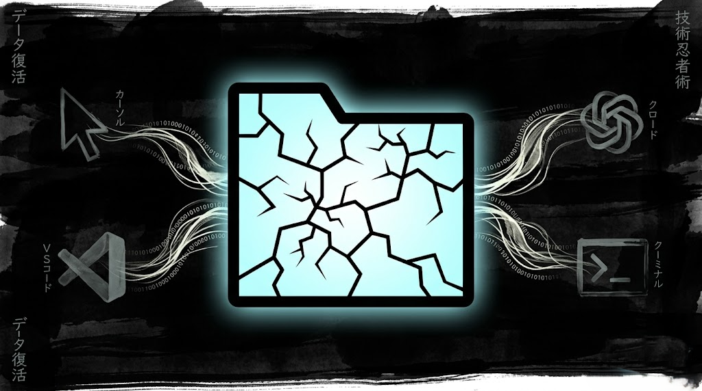

# Edo Tensei – AI Session 交接管理器

[](https://marketplace.visualstudio.com/items?itemName=Pain-Labs.edo-tensei)
[](https://marketplace.visualstudio.com/items?itemName=Pain-Labs.edo-tensei)
[](https://pain-labs.github.io/Edo-Tensei/llms.txt)

繁體中文 | **[English](../README.md)** | [日本語](README.ja.md) | [한국어](README.ko.md) | [简体中文](README.zh-CN.md)



---

## 什麼是 Edo Tensei？

AI 額度在任務進行到一半時用完，切換到另一款 IDE 不應該代表你要重新解釋所有背景。

**Edo Tensei**（穢土轉生）從你電腦上安裝的各款 IDE 中提取本機 AI 對話紀錄，並打包成可直接貼上的交接 Prompt — 讓下一個 AI Agent 能從上一個停下的地方繼續。

### 名稱由來與邏輯

在《火影忍者》中，**穢土轉生**（Edo Tensei）是一種禁術，能將死者的靈魂召喚回人間並束縛於活人容器中，使其恢復生前的記憶與能力。

本工具以此命名，象徵著 AI 開發中的「上下文續命」：

- **死者 (The Deceased)**：因配額耗盡、IDE 崩潰或切換工具而「中斷」的舊會話。
- **祭品/媒介 (The Vessel)**：本工具提取並封裝的 **Handoff Prompt**。
- **轉生 (The Reincarnation)**：將 Prompt 貼入新 IDE，讓原本「死去」的開發思路在新的 AI 實體中完美重生。


---

> **平台限制**：目前僅支援 Windows。macOS 與 Linux 尚未開發。

## 支援的 IDE

| IDE / Agent | 本機儲存路徑 | 備注 |
| :--- | :--- | :--- |
| GitHub Copilot Chat | `%APPDATA%/Code/User/…/chatSessions/` | JSON & JSONL |
| Cursor | `~/.cursor/projects/` | JSONL |
| Claude Code CLI | `~/.claude/projects/` | JSONL |
| OpenAI Codex CLI | `~/.codex/` | JSONL |
| Kiro | `%APPDATA%/Kiro/…/kiroagent/` | JSON（`.chat`） |
| Windsurf | `~/.codeium/windsurf/cascade/` | 二進位格式，僅支援路徑模式 |
| Antigravity | `~/.gemini/antigravity/brain/` | 僅 Preview Log — 見已知限制 |

---

## 核心功能

- **多 IDE 提取**：自動掃描所有支援的 IDE，以 `IDE → 專案 → Session` 三層結構呈現。
- **專案範圍掃描**：「掃描專案 Sessions」只列出與目前 workspace 相符的對話紀錄。
- **兩種交接模式**：
  - **路徑模式**（預設）：輸出 session 檔案路徑 + 各 IDE 專屬閱讀指引。省 token，接手端只讀必要段落。
  - **全文模式**：嵌入完整對話內容。相容性最廣，但 token 消耗較高。
- **一鍵穢土轉生**：複製格式化的交接 Prompt 到剪貼簿，直接貼進新的 AI 對話即可接手。
- **匯出到 `.edo_tensei/`**：將交接 Prompt 存成 Markdown 檔，以 `IDE/專案/時間戳記` 結構整理。
- **原始檔預覽**：直接在 VS Code 中開啟原始 session 檔案供查閱或手動編輯。
- **`.gitignore` 小幫手**：首次匯出時自動提示加入 `.edo_tensei/`，避免誤提交到版本庫。


---

## 快速開始

1. 點擊 VS Code Activity Bar 的 **Edo Tensei** 圖示（歸檔圖示）開啟側邊欄。
2. 點擊 **掃描專案 Sessions** 尋找與目前 workspace 相符的紀錄，或點擊 **取得所有歷史 Sessions** 全局掃描。
3. 在樹狀結構中依 IDE 瀏覽 sessions。
4. 右鍵點擊某個 session，選擇 **複製交接 Prompt**。
5. 貼進新的 IDE / AI Agent，繼續任務。


---

## 設定

在 VS Code 設定中搜尋 `edoTensei`。

| 設定 | 選項 | 預設值 | 說明 |
| :--- | :--- | :--- | :--- |
| `edoTensei.handoffMode` | `path` / `fullText` | `path` | 推薦使用 `path` 以節省 token。 |
| `edoTensei.promptLanguage` | `English` / `Traditional Chinese` | `English` | 產生的交接 Prompt 語言。 |
| `edoTensei.customScanPaths` | 物件 `{ "claude": [], … }` | `{}` | 覆蓋各 IDE 的預設掃描路徑。 |

### 自訂掃描路徑範例

```json
{
  "edoTensei.customScanPaths": {
    "claude": ["D:/custom-claude-projects"],
    "copilot": ["E:/another-vscode-profile/chatSessions"]
  }
}
```

---

## 指令列表

所有指令均可透過指令面板（`Ctrl+Shift+P`）在 `Edo Tensei` 分類下找到。

| 指令 | 說明 |
| :--- | :--- |
| Scan Project Sessions | 掃描符合目前 workspace 的 sessions |
| Fetch ALL Historical Sessions | 掃描所有 IDE 的全部本機 sessions |
| Copy Handoff Prompt | 複製選取 session 的交接 Prompt |
| View Parsed Session | 以 Markdown 預覽格式開啟 session |
| Preview Raw Session File | 開啟原始 session 檔案 |
| Copy Raw File Path | 複製 session 檔案路徑到剪貼簿 |
| Export Session to .edo_tensei | 將交接 Prompt 儲存為 Markdown 檔 |
| Export All Sessions to .edo_tensei | 將所有已掃描的 sessions 匯出 |

---

## 隱私與本機優先

Edo Tensei 完全**本機優先**。所有提取與解析均在你的電腦上執行，直接讀取本機檔案（SQLite、JSONL、JSON 或文字檔），不傳送任何資料至外部伺服器。

`.edo_tensei/` 匯出資料夾會建立在 workspace 內，首次使用時擴充功能會提示你加入 `.gitignore`。

---

## 已知限制

- **macOS / Linux**：尚未支援。目前僅限 Windows 平台。
- **Trae**：尚未支援。本機資料庫使用 SQLCipher 加密，目前無公開金鑰可用。
- **Windsurf**：Session 檔案使用二進位 protobuf 格式。Edo Tensei 僅支援**路徑模式** — 複製路徑與閱讀指引，無法嵌入完整對話。
- **Antigravity**：從 `overview.txt`（預覽 log）提取，每則訊息截斷於約 900 字元。完整對話歷史僅存於 Antigravity 雲端，本機無法存取。

---

## 推薦搭配

### Quick Prompt

AI Agent 執行任務時，在 IDE 內隨手記下下一步任務與可重用片段，不需切換視窗。

[VS Code Marketplace](https://marketplace.visualstudio.com/items?itemName=winterdrive.quick-prompt) | [Open VSX Registry](https://open-vsx.org/extension/winterdrive/quick-prompt)

### VirtualTabs

跨任意目錄，依任務整理檔案，設定跨 session 持久保留。

[VS Code Marketplace](https://marketplace.visualstudio.com/items?itemName=winterdrive.virtual-tabs) | [Open VSX Registry](https://open-vsx.org/extension/winterdrive/virtual-tabs)

---

## 更新日誌

完整版本紀錄請見 [CHANGELOG.md](../CHANGELOG.md)。

---

## 授權

[MIT](../LICENSE)
